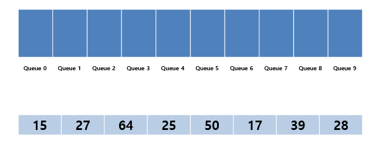
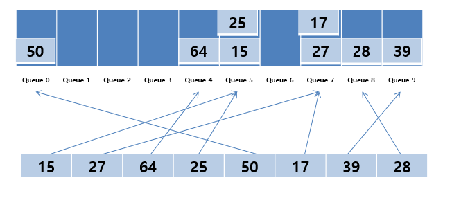
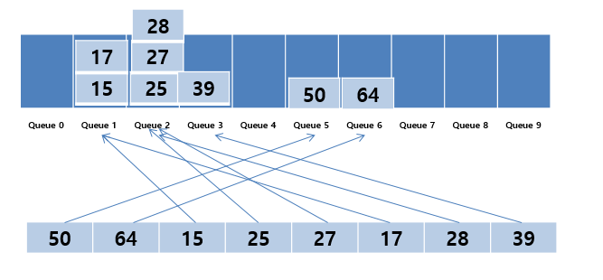

# 기수정렬( Radix sort)

낮은 자리수부터 비교하여 정렬해 간다는 것을 기본 개념으로 하는 정렬 알고리즘입니다.

기수 정렬은 비교 연산을 하지 않으며 정렬 속도가 빠르지만 데이터 전체 크기에 기수 테이블의 크기만큼 메모리가 더 필요합니다.

## 구현방식

1. **0~9 까지의 Queue 자료구조을 준비한다. → 추가적인 메모리**
2. 모든 데이터에 대하여 가장 낮은 자리수에 해당하는  queue에 차례대로 데이터를 둔다.
3. 0부터 차례대로 queue에서 데이터를 다시 가져온다.
4. 가장 높은 자리수를 기준으로 하여 가리수를 높여가며 2, 3번 과정을 반복한다.



해당 배열에 대해 기수정렬을 시도하겠습니다.



먼저 1의 자리수부터 시작합니다. 데이터 순서대로 각 1의 자리에 해당되는 Queue에 데이터가 들어가게 됩니다.

1의 자리 정렬이 완료되면 10의 자리에 대하여 같은 작업을 반복합니다.



가장 높은 자리수(여기서는 10의 자리)까지 완료했다면 0부터 차례로 Queue를 꺼내 정렬을 완성시킵니다.

<aside>
💡 기수 정렬(Radix Sort)의 시간 복잡도는 O(dn)이다. 다만, 추가적인 메모리가 필요하며, 정렬할 수 있는 레코드의 타입이 제한된다.

</aside>

```java
import java.util.LinkedList;
import java.util.Queue;

public class Main {

	public static void main(String[] args) {
		int[] arr = {28, 93, 39, 81, 62, 72, 38, 26};

		radix_Sort(arr.length, arr);

		for (int i = 0; i < arr.length; ++i) {
			System.out.print(arr[i] + " ");
		}
	}

	public static void radix_Sort(int n, int[] arr) {
		//bucket 초기화 //0 - 9까지 버킷 생성
		Queue<Integer>[] bucket = new LinkedList[bucketSize];
		for (int i = 0; i < 10; ++i) {
			bucket[i] = new LinkedList<>();
		}

		int factor = 1;

		//정렬할 자릿수의 크기 만큼 반복한다.
		for (int d = 0; d < 2; ++d) {
			for (int i = 0; i < n; ++i) {
				bucket[(arr[i] / factor) % 10].add(arr[i]);
			}

			for (int i = 0, j = 0; i < bucketSize; ++i) {
				while (!bucket[i].isEmpty()) {
					arr[j++] = bucket[i].poll();
				}
			}

			factor *= 10;
		}
	}
```