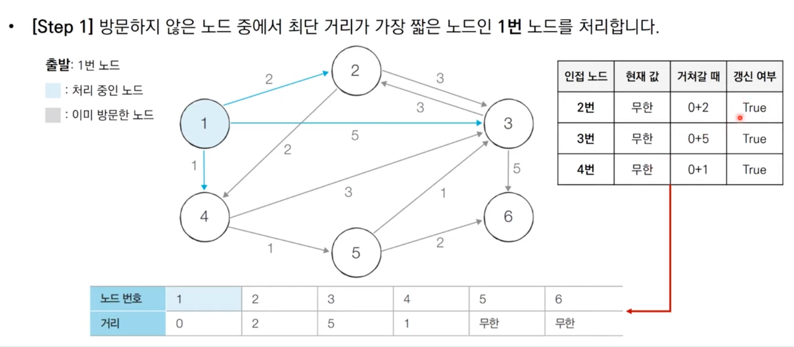
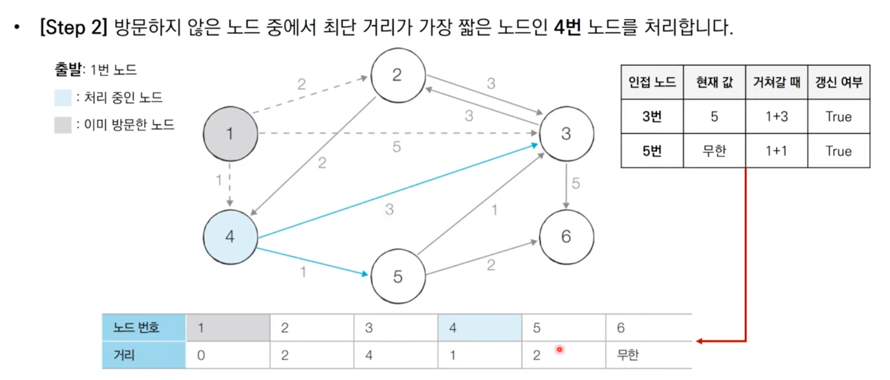
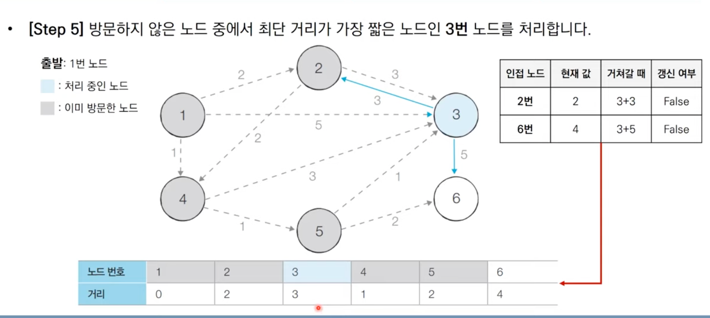

# 다익스트라

# 최단경로 알고리즘

최단 경로 알고리즘은 말그대로 가장 짧은 경로를 찾는 알고리즘을 의미한합니다.

다양한 문제 상황

- 1. 한 지점에서 다른 한 지점까지의 최단 경로 → 다익스트라, 플로이드 워셜(느림)
- 2. 한 지점에서 다른 모든 지점까지의 최단 경로 → 다익스트라, 플로이드 워셜(느림)
- 3. 모든 지점에서 다른 모든 지점까지의 최단 경로 → 플로이드 워셜(느림)

# 다익스트라

- 특정한 노드에서 출발하여 다른 모든 노드로 가는 최단경로를 계산
- 다익스트라 알고리즘은 음의 간선이 없을 때 정상적으로 동작
- 다익스트라는 그리디 알고리즘으로 분류 -> 매 상황에서 가장 비용이 적은 노드를 선택
- DP(최단 거리 테이블) 적용
- 인접 행렬로 구현하면 시간 복잡도는 O(N^2)이다.
- 인접 리스트로 구현하면 시간 복잡도는 O(N*logN)이다. → 선형 탐색으로 시간 초과가 나는 문제는 인접 리스트로 접근해야한다. (우선순위 큐)

## 동작 과정

1. 출발 노드를 설정합니다.
2. 최단 거리 테이블을 초기화합니다.
3. 방문하지 않은 노드 중에서 최단 거리가 가장 짧은 노드를 선택합니다.
4. 해당 노드를 거쳐 다른 노드로 가는 비용을 계산하여 최단 거리 테이블을 갱신합니다.
5. 위 과정에서 3번 4번을 반복합니다.







모든 노드를 방문해가며 최단 거리 테이블을 갱신하면 됩니다.

```java
public class 개선_다익스트라 {
   static class Node implements Comparable<Node>{
      private int index;
      private int distance;

      public Node(int index,int distance){
         this.index=index;
         this.distance=distance;
      }

      public int getIndex(){
         return this.index;
      }

      public int getDistance(){
         return this.distance;
      }
			//거리순 정렬
      @Override
      public int compareTo(Node other){
         if(this.distance<other.distance){
            return -1;
         }
         return 1;
      }
   }
   public static final intINF=(int)1e9;
   public static intn,m,start;
   public static int[]d=new int[100001];
   public static ArrayList<ArrayList<Node>>graph=new ArrayList<ArrayList<Node>>();

   public static void dijkstra(int start){
			//우선순위큐 -> 거리가 가까운 놈부터 꺼내야 하니깐
      PriorityQueue<Node> pq=new PriorityQueue<>();
      pq.offer(new Node(start,0));
			d[start]=0;
      while(!pq.isEmpty()){
         Node node=pq.poll();
         int dist=node.getDistance();
         int now=node.getIndex();
				//최단경로보다 길면 볼 필요 없음
         if(d[now]<dist) continue;
				//해당 노드와 연결된 노드 반복문
         for(int i=0;i<graph.get(now).size();i++){
						//거리 구하기
            int cost=d[now]+graph.get(now).get(i).getDistance();
						//해당 거리가 더 최단거리이면 변경
            if(cost<d[graph.get(now).get(i).getIndex()]){
							 d[graph.get(now).get(i).getIndex()]=cost;
               pq.offer(new Node(graph.get(now).get(i).getIndex(),cost));
            }
         }
      }
   }

   public static void main(String[] args){

      Scanner sc=new Scanner(System.in);

			n=sc.nextInt();
			m=sc.nextInt();
			start=sc.nextInt();

      for (int i = 0; i <=n; i++) {
				graph.add(new ArrayList<Node>());
      }
			//해당 노드 인접리스트에 집어넣기
      for(int i=0;i<m;i++){
         int a=sc.nextInt();
         int b=sc.nextInt();
         int c=sc.nextInt();
				graph.get(a).add(new Node(b,c));
      }

			//최단 거리 테이블 무한대로 초기화
      Arrays.fill(d,INF);

			dijkstra(start);

      for(int i=1;i<=n;i++){
         if(d[i]==INF){
            System.out.println("INF");
         }
         else{
            System.out.println(d[i]);
         }
      }
   }
}

```