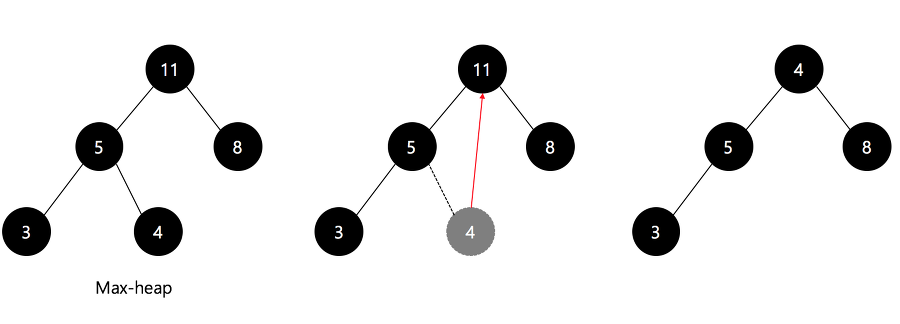
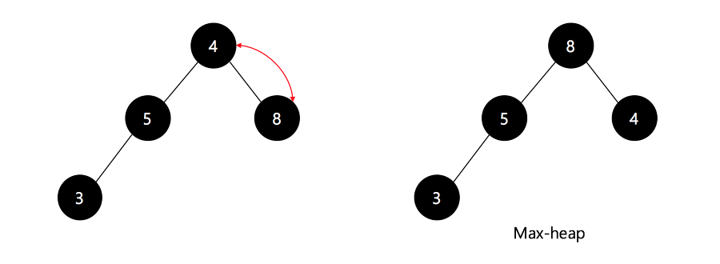

# 힙정렬

## 힙정렬이란?

완전 이진 트리를 기본으로 하는 힙(Heap) 자료구조를 기반으로한 정렬 방식

시간복잡도 : 언제나 O(nlogn)

## 힙정렬 구현

### 1. 힙 자료구조 구현

- 부모노드는 항상 자식 노드보다 커야한다.
- 형제 노드간의 우선순위는 고려하지 않는다.
- 힙은 모든 노드가 정렬된 채 유지되는것이 아닌 느슨한 정렬 상태! 최대힙은 최댓값 최소힙은 최솟값을 구하는것뿐 ex) 밑에 최소힙을 보면 3 < 10 < 35 > 23 > 19 47…
- 왼쪽 자식 노드 인덱스 = 부모 노드 인덱스 x 2 + 1
- 오른쪽 자식 노드 인덱스 = 부모 노드 인덱스 x 2 + 2
  

```java
private static void heapify(int[] arr,int parentIndex,int lastIndex){
  int leftChildIndex=2*parentIndex+1;
  int rightChildIndex=2*parentIndex+2;
  int max=parentIndex;

  if(leftChildIndex<lastIndex&&arr[max]<arr[leftChildIndex]){
   max=leftChildIndex;
  }

  if(rightChildIndex<lastIndex&&arr[max]<arr[rightChildIndex]){
   max=rightChildIndex;
  }

  if(parentIndex!=max){
   swap(arr,max,parentIndex);
   heapify(arr,max,lastIndex);
  }

 }
```

### 2. 힙 정렬 수행
힙은 완전 정렬이 아닌 느슨한 정렬 상태이다. 한번 힙을 만든다고 해서 정렬된 배열이 나오는게 아니다. 루트 노드만 최댓값이고 최솟값인것이기 때문에 루트노드를 배열 size만큼 꺼내야한다. 루트노드의 값을 꺼내면 해당 노드가 비워져 다른 노드로 채워야한다.
공식 ) 마지막 노드를 루트 노드에 삽입 후, 다시 heapify통해 힙 자료구조로 변경


```java
public static void heapSort(int[] arr){
  int size=arr.length;

  if(size<2){
   return;
  }

  int parentIndex=getParent(size-1);//가장 마지막 노드 부모 인덱스 찾기

  for(int i=parentIndex;i>=0;i--){//가장 마지막 노드 부모 인덱스부터 뒤에있는 부모 인덱스 가져오기
   heapify(arr,i,size-1);
  }

  for(int i=size-1;i>0;i--){
   swap(arr,0,i);//정렬하기 위해 최대값 빼오고 마지막 노드 값을 루느 노드로 바꿔줌
   heapify(arr,0,i-1);//최대힙으로 구성
  }
 }
```
[장점]
최악의 경우에도 O(NlogN) 으로 유지가 된다.
힙의 특징상 부분 정렬을 할 때 효과가 좋다.
[단점]
한 번 최대힙을 만들면서 불안정 정렬 상태에서 최댓값만 갖고 정렬을 하기 때문에 안정정렬이 아니다.
