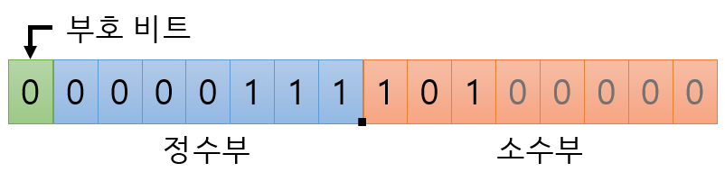

# 고정 소수점 & 부동 소수점

컴퓨터에서 정수를 표현하는 방법은 이진수(0과 1)이다. 그렇다면 소수는 어떻게 표현할까?

컴퓨터에서 실수를 표현하는 방법은 `고정 소수점`과 `부동 소수점` 두가지 방식이 있다.

## 1) 고정소수점 (Fixed Point)

소수점이 찍힐 위치를 미리 정해놓고 소수를 표현하는 방식 (정수 + 소수) + 10진수를 2진수로 바꿨으면, 그걸 그대로 박아넣는 방식이다.

예를 들면 7.625라는 실수가 있다고 치자. 2진수로 변환하면 111.101이 될 것이다. 이걸 이렇게 저장한다.

- 16비트 체계라고 가정하면
- 맨 앞 1자리는 부호 비트로 0이면 양수 1이면 음수라는 뜻이다.
- 나머지 비트들은 소수점을 기준으로 정수부와 소수부를 표현하는 비트로 나눠지는데 소수점의 위치는 미리 정해둔다. 소수부의 경우 앞에서부터 채우며 남은 뒷자리는 0으로 채운다.
- 구현이 쉽다.
- 정밀도가 낮아 거의 쓰이지 않는다.

## **3) 부동소수점 (Floating Point)**

실수를 가수부 + 지수부로 표현한다. + 부동소수점 표현 방식에서는 2진수로 변환한 결과를 그대로 박아넣지 않고 몇 가지 과정을 추가로 거친다.

- 가수 : 실수의 실제값 표현
- 지수 : 크기를 표현함. 가수의 어디쯤에 소수점이 있는지 나타냄

### 정규화

1.xxxx... * 2^n 형태로 변환하는 것을 말한다. 정수부에 1만 남을 때까지 소수점을 왼쪽 또는 오른쪽으로 *이동*시키고 이동한 칸 수만큼 n 자리에 집어넣으면 된다.

ex)

### 111.101을 정규화하면 1.11101 * 2^2

7.625라는 실수를 예로 들어 부동소수점을 만들어보겠다.

- 부호 비트는 고정소수점에서와 마찬가지로 0이면 양수, 1이면 음수를 의미한다.
- 23자리 가수부는 정규화 결과 소수점 오른쪽에 있는 숫자들을 왼쪽부터 그대로 넣으면 된다. 남는 자리는 0으로 채운다.
- 지수
    - 2^n에서 n에 해당하는 수에다가
    - 'bias' 라고 하는 지정된 숫자를 더한다.(IEEE 표준에서 32비트를 쓰는 경우 bias는 127이라고 규정)
    - 2^2니깐 2 + 127를 더해서 10000001이 들어가게 된다.
- bias란?
    - 예를 들면 0.000101이라는 이진수가 있다 치자. 정규화에 대해서 설명할 때 정수부를 1로 만들어야 한다고 했다. 그러니까 왼쪽이 아니라 오른쪽으로 소수점을 밀어서 1.01 * 2^-4가 된다.
    - -4값은 어떻게 처리할까? 부호비트는 전체 숫자의 부호로 상관없음
    - 8자리를 가지고 음수랑 양수를 둘 다 표현하자니, (10진수 기준으로) 0~127 구간은 음수, 128~255 구간은 양수를 표현하도록 만든 것. → 따라서 127을 더하는거 (-4에 127더하면 123)