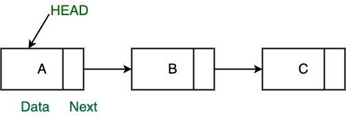

### LINKED LIST

연속적인 메모리 위치에 데이터를 저장하는 배열과 달리, 
링크드 리스트는 데이터를 저장할 때, 다음 데이터의 위치를 저장하는 포인터를 사용한다.



각 노드는 데이터 필드와 다음 노드에 대한 참조를 포함하는 노드로 구성

### 링크드리스트를 사용하는 이유
1. 배열의 제한사항
   - 배열의 크기가 고정되어있어 미리 요소의 수에 대해 할당을 받아야함.
   - 새로운 요소를 삽입하는 것은 비용이 많이 듬 (공간 생성, 기존 요소 전부 이동)

### 링크드리스트 장단점
**장점**
1. 동적 크기
2. 삽입과 삭제 용이

**단점**
1. 임의로 액세스를 허용할 수 없음. 즉, 첫 번째 노드부터 순차적으로 요소에 액세스 해야함
2. 포인터의 여분의 메모리 공간이 목록의 각 요소에 필요


### 구현
1. 노드 구현
``` java
public class Node<T> {
    T data;
    Node<T> next = null;
    
    public Node(T data) {
        this.data = data;
    }
}
```

2. 싱글리스트리스트 구현
``` java
public class SingleLinkedList<T> {
    public Node<T> head = null;
    
    public class Node<T> {
        T data;
        Node<T> next = null;
        
        public Node(T data) {
            this.data = data;
        }
    }
    
    public void addNode(T data) {
        if (head == null) {
            head = new Node<T>(data);
        } else {
            Node<T> node = this.head;
            while (node.next != null) {
                node = node.next;
            }
            node.next = new Node<T>(data);
        }
    }
    
        public void printAll() {
        if (head != null) {
            Node<T> node = this.head;
            System.out.println(node.data);
            while (node.next != null) {
                node = node.next;
                System.out.println(node.data);
            }
        }
    }
    
        public void addNodeInside(T data, T isData) {
        Node<T> searchedNode = this.search(isData);
        
        if (searchedNode == null) {
            this.addNode(data);
        } else {
            Node<T> nextNode = searchedNode.next;
            searchedNode.next = new Node<T>(data);
            searchedNode.next.next = nextNode;
        }
    }
} 
```
