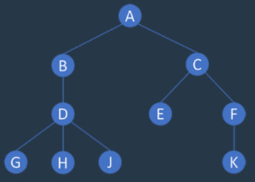
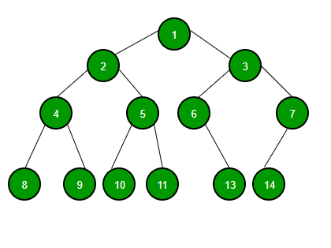

# 트리 (Tree)

## **Tree**

- 트리(Tree)는 그래프의 일종으로 정점과 간선을 이용하여 데이터의 배치 형태를 추상화한 자료구조이다.
- 서로 다른 두 노드를 연결하는 길이 하나뿐인 그래프를 트리라고 부른다.
- 힙(Heap)을 구현하는 방법 중 하나가 트리이다.

### **트리를 구성하고 있는 구성요소들(용어)**

- Node (노드) : 트리를 구성하고 있는 각각의 요소를 의미한다.
- Edge (간선) : 트리를 구성하기 위해 노드와 노드를 연결하는 선을 의미한다.
- Root Node (루트 노드) : 트리 구조에서 최상위에 있는 노드를 의미한다.
- Terminal Node ( = leaf Node, 단말 노드) : 하위에 다른 노드가 연결되어 있지 않은 노드를 의미한다.
- Internal Node (내부노드, 비단말 노드) : 단말 노드를 제외한 모든 노드로 루트 노드를 포함한다.

## **트리(Tree)의 특징**

- 트리 자료구조는 일반적으로 대상 정보의 각 항목들을 계층적으로 구조화할 때 사용하는 비선형 자료구조이다.
- 트리의 구조는 '데이터 저장'의 의미보다는 '저장된 데이터를 더 효과적으로 탐색'하기 위해서 사용된다.
- 리스트와 다르게 데이터가 단순히 나열되는 구조 X --> 트리는 부모(parent)와 자식(child)의 계층적인 관계로 표현된다.
- 트리는 사이클이 없다. (만약 사이클이 만들어진다면, 그것은 트리가 아니고 그래프다)
- 트리에서 루트노드를 제외한 모든 노드는 단 하나의 부모노드를 가진다.

## **트리 순회**

트리를 순회하는 방식은 총 4가지

**1. 전위 순회(pre-order)**

각 루트(Root)를 순차적으로 먼저 방문하는 방식이다.

(Root → 왼쪽 자식 → 오른쪽 자식)

1 → 2 → 4 → 8 → 9 → 5 → 10 → 11 → 3 → 6 → 13 → 7 → 14

**2. 중위 순회(in-order)**

왼쪽 하위 트리를 방문 후 루트(Root)를 방문하는 방식이다.

(왼쪽 자식 → Root → 오른쪽 자식)

8 → 4 → 9 → 2 → 10 → 5 → 11 → 1 → 6 → 13 → 3 →14 → 7

**3. 후위 순회(post-order)**

왼쪽 하위 트리부터 하위를 모두 방문 후 루트(Root)를 방문하는 방식이다.

(왼쪽 자식 → 오른쪽 자식 → Root)

8 → 9 → 4 → 10 → 11 → 5 → 2 → 13 → 6 → 14 → 7 → 3 → 1

**4. 레벨 순회(level-order)**

루트(Root)부터 계층 별로 방문하는 방식이다.

1 → 2 → 3 → 4 → 5 → 6 → 7 → 8 → 9 → 10 → 11 → 13 → 14