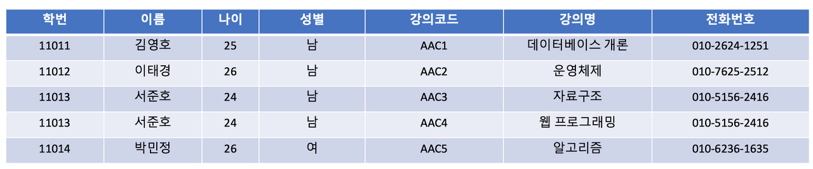

# 이상(Anomaly)

## 이상

릴레이션에서 일부 속성들의 종속이나 데이터의 중복으로 인해 데이터 조작시 불일치가 발생하는 것.

즉, 테이블을 설계할 때 잘못 설계하여 데이터를 삭제,수정,삽입할 때 논리적으로 오류가 생기는 것을 말한다.
대부분 이상현상이 발생하는 데이터의 중복성때문인데 이를 제거하는 과정이 정규화이다.

이상현상을 보기위해 정규화 과정이 필요한 데이터베이스를 확인해보자.

**1. 삽입 이상** : 자료를 삽입할 때 의도하지 않은 자료까지 삽입해야만 자료를 테이블에 추가가 가능한 현상입니다.

강의를 아직 수강하지 않은 새로운 학생을 삽입할 경우 강의코드 속성에는 null값이 들어가야 하는 문제가 생깁니다.

**2. 갱신 이상** : 중복된 데이터 중 일부만 수정되어 데이터 모순이 일어나는 이상입니다.

강의코드가 "AAC3"인 서준호의 전화번호를 수정할 경우, 3번째 튜플의 데이터만 수정될 것입니다. 그러면 3,4번째 튜플은 같은 사용자의 데이터 인데도 불구하고 전화번호가 다르게 됩니다.

**3. 삭제 이상** : 어떤 정보를 삭제하면, 유용한 다른 정보까지 삭제되어버리는 이상입니다.

강의코드가 AAC1인 데이터베이스 개론 강의를 삭제하게 되면 김영호 학생의 데이터까지 삭제되어버립니다.