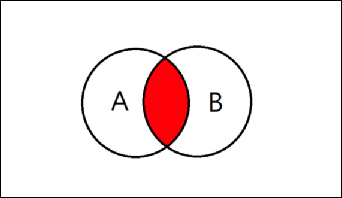

## Join

### 조인이란?
> 두 개 이상의 테이블을 연결하여 원하는 데이터를 검색하는 방법  
> 두 테이블의 조인을 위해서는 기본 키 (Primary Key, PK),


두 테이블의 조인을 위해서는 기본키(PRIMARY KEY, PK) 와 외래키(FOREIGN KEY, FK) 관계로 맺어져야 하고,  
이를 **일대다 관계** 라고 합니다.  


<br>

### JOIN 종류
- INNER JOIN
  - 교집합의 연산과 같으며, 기존 테이블과 join 테이블의 중복된 값을 보여준다.
    
    

    
  ```sql
    SELECT A.NAME, B.AGE
    FROM EX_TABLE_A
    INNER JOIN JOIN_TABLE_B ON A.NO_EMP = B.NO_EMP;
   ```
    
- LEFT OUTER JOIN
  - 기준 테이블 값과 조인 테이블과 중복된 값을 보여준다.
  

- RIGHT OUTER JOIN
- FULL OUTER JOIN
- CROSS JOIN
- SELF JOIN

