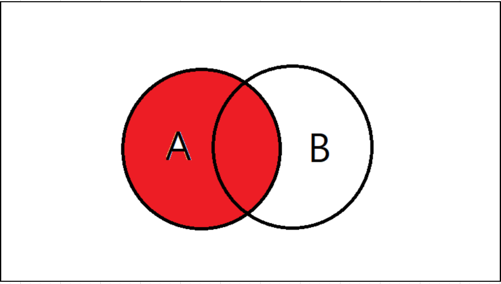
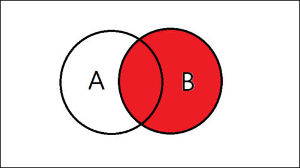
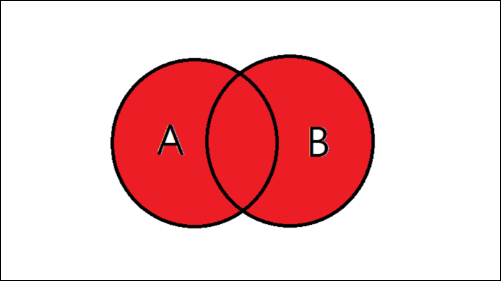
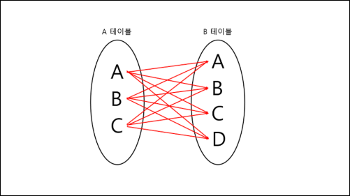

## Join

### 조인이란?
> 두 개 이상의 테이블을 연결하여 원하는 데이터를 검색하는 방법  
> 두 테이블의 조인을 위해서는 기본 키(PRIMARY KEY, PK) 와 외래 키(FOREIGN KEY, FK) 관계로 맺어져야 하고,    
이를 **일대다 관계** 라고 합니다.


<br>

### JOIN 종류
- INNER JOIN
  - 교집합의 연산과 동일합니다.
  - 기존 테이블과 join 테이블의 중복된 값을 보여준다.
    
    

    
  ```SQL
    SELECT A.NAME, B.AGE
    FROM EX_TABLE A
    INNER JOIN JOIN_TABLE B ON A.NO_EMP = B.NO_EMP;
   ```

- OUTER JOIN
  - OUTER JOIN 은   
    <U>LEFT OUTER JOIN, RIGHT OUTER JOIN, FULL OUTER JOIN</U> 이 있습니다.  
  
  <br>
  
  - LEFT OUTER JOIN
    - 기준 테이블 값과 조인 테이블의 중복된 값을 보여준다.
  

  ```sql
    SELECT A.NAME, B.AGE
    FROM EX_TABLE A
    LEFT OUTER JOIN JOIN_TABLE B ON A.NO_EMP = B.NO_EMP;
  ```

- RIGHT OUTER JOIN
  - LEFT OUTER JOIN 과는 반대로 오른쪽 테이블 기준으로 JOIN 하는 것이다.  
  
  ```sql
    SELECT A.NAME, B.AGE
    FROM EX_TABLE A
    RIGHT OUTER JOIN JOIN_TABLE B ON A.NO_EMP = B.NO_EMP;
  ```
- FULL OUTER JOIN
  - 합집합을 의미한다.  
  - A와 B 테이블의 모든 데이터가 검색된다.  
  
```sql
  SELECT A.NAME, B.AGE
  FROM EX_TABLE A
  FULL OUTER JOIN JOIN_TABLE B ON A.NO_EMP = B.NO_EMP;
```
  
- CROSS JOIN
  - 두 테이블의 데이터 모든 조합을 받아오는 방법 = 교차 조인  
  - 왼쪽 테이블의 데이터 1개 당 오른쪽 테이블 데이터를 처음부터 끝까지 하나씩 결합한다.  
  

  ```sql
    SELECT A.NAME, B.AGE
    FROM EX_TABLE A
    CROSS JOIN JOIN_TABLE B;
  ```


- SELF JOIN
  - 자기 자신과 자기 자신을 조인하는 것이다.
  - 자신이 갖고 있는 칼럼을 다양하게 변형시킬 때, 활용된다.

  ```sql
  SELECT A.NAME, B.AGE
  FROM EX_TABLE A, EX TABLE B
  ```
  

