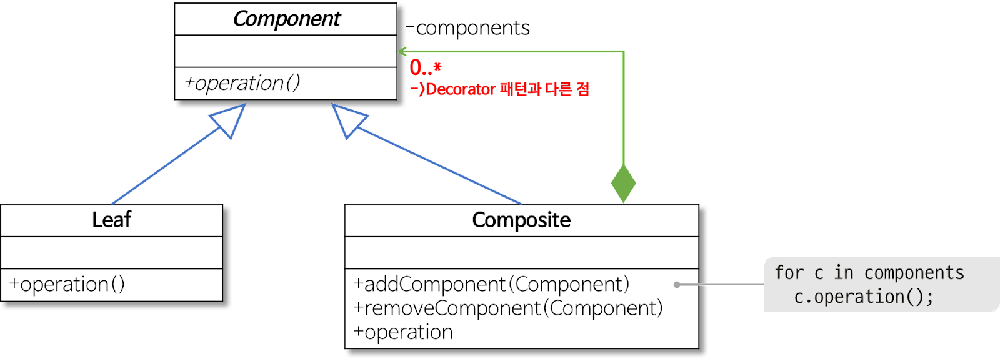

# 컴포지트 패턴(Composite Pattern)

## **컴포지트 패턴이랑?**

**여러 개의 객체들로 구성된 복합 객체와 단일 객체를 클라이언트에서 구별 없이 다루게 해주는 패턴**

**즉, 전체-부분의 관계(Ex. Directory-File, 트리)를 갖는 객체들 사이의 관계를 정의할 때 유용하다.**

**또한 클라이언트는 전체와 부분을 구분하지 않고 동일한 인터페이스 를 사용할 수 있다.**


## **구현**

**전체(Zoo)와 부분(Cat, Dog…)관계를 갖는 객체를 정의하고자한다. Cat. Dog 클래스는 eat()가 가능하다. zoo에서도 전체 동물 eat()이 가능하도록 할 때 컴포지트 패턴을 이용하겠습니다.**

### **Component (Animal)**

1. **구체적인 부분**
2. **즉 Leaf 클래스와 전체에 해당하는 Composite 클래스에 공통 인터페이스를 정의**

### **Leaf (Cat, Dog…)**

1. **구체적인 부분 클래스**
2. **Composite 객체의 부품으로 설정**

### **Composite (AnimalsGroup - zoo)**

1. **전체 클래스**
2. **복수 개의 Component를 갖도록 정의**
3. **그러므로 복수 개의 Leaf, 심지어 복수 개의 Composite 객체를 부분으로 가질 수 있음**

```java
class Animal{
 abstract void eat(){
   }
}

class Cat extends Animal{
@Override
 void eat(){
   print("야옹") }
}

class Dog extends Animal{
@Override
 void eat(){
   print("멍") }
}

class AnimalGroup extends Animal{
 List<Animal> animals=new ArrayList<>();
 void add(Animal animal){
   animals.append(animal)}

@Override
 void speak(){
   print("전체 다 eat")
   for(Animal animal:animals){
     animal.eat()
}
}}
```

---

```java
AnimalGroup cat_group = new AnimalGroup();
cat_group.add(new Cat())
cat_group.add(new Cat())
cat_group.add(new Cat())

AnimalGroup dog_group = new AnimalGroup();
dog_group.add(new Dog())
dog_group.add(new Dog())

AnimalGroup zoo = new AnimalGroup();
zoo.add(cat_group)
zoo.add(dog_group)

zoo.eat()
// 출력문
다 eat
야옹
야옹
야옹
멍
멍
```

---