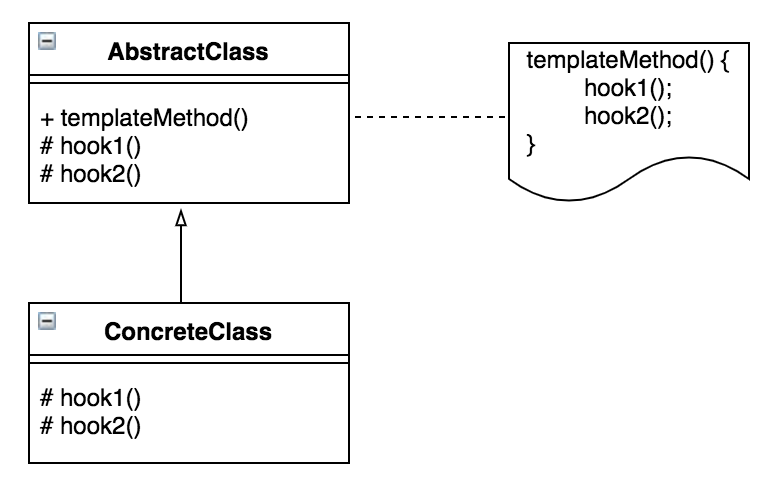

# 템플릿 메소드 패턴(Template Method Pattern)

## **템플릿 메서드 패턴?**

 하위 클래스에서 사용되지만, 변하지 않는 기능을 상위 클래스에 저장해 놓고, 확장할 기능은 서브 클래스에서 만들도록 설계한다.



AbstractClass는 템플릿 메소드를 정의하며, 하위 클래스에서 알맞게 확장할 수 있는 메소드인 훅 메소드를 제공합니다. 여기서, 템플릿 메소드는 일반적인 메소드와 훅 메소드를 이용합니다. 그리고 ConcreteClass는 물려받은 훅 메소드를 재정의하는 역할을 합니다.

## 구현

예를들어, 모든 피자는  반죽 → 토핑 → 굽기 로 3단계로 이루어져있고 이 단계는 항상 유지되며, 순서가 바뀔 일은 없다. 토핑은 피자 종류에 따라 변경된다.

| 포테이토 피자 | 고구마 피자 |
| --- | --- |
| 1. 반죽 | 1. 반죽 |
| 1. 감자 토핑 | 2.  고구마 토핑 |
| 1. 굽기 | 3. 굽기 |

### 조건

- 상위 클래스는 추상(abstract)로 만든다.
- 단계를 진행하는 메소드는 수정이 불가능하도록 final 키워드를 추가한다.
- 각 단계들은 외부는 막고, 자식들만 활용할 수 있도록 protected로 선언한다.

```java
abstract class Pizza {

    protected void 반죽() { System.out.println("반죽!"); }
    //abstract 키워드를 통해 자식 클래스에서는 선택적으로 메소드를 오버라이드 할 수 있게 된다.
    abstract void 토핑() {}
    protected void 굽기() { System.out.println("굽기!"); }

    final void makePizza() { // 상속 받은 클래스에서 수정 불가
        this.반죽();
        this.토핑();
        this.굽기();
    }

}
```

```java
class PotatoPizza extends Pizza {
    @Override
    void 토핑() {
        System.out.println("고구마 넣기!");
    }
}
class TomatoPizza extends Pizza {
    @Override
    void 토핑() {
        System.out.println("토마토 넣기!");
    }
}
```

---

**정리**

템플릿 메소드 패턴은 알고리즘의 뼈대를 맞추는 것을 목표로 합니다. 즉, 전체적인 레이아웃을 통일하지만 상속받은 클래스는 훅 메소드를 이용하여 확장할 수 있도록 유연성을 주는 디자인 패턴이라고 할 수 있습니다