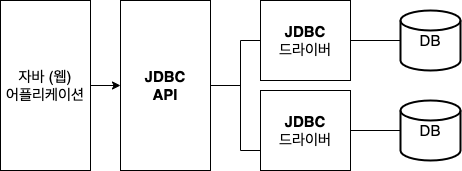
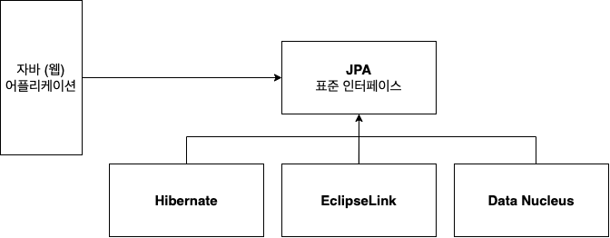

### ORM

- **JDBC**(**J**ava **D**ata**B**ase **C**onnectivity) API
  - JAVA 진영의 DataBase 연결 표준 인터페이스
  - 자바 프로그램 내에서 DB 종류에 상관없이 <U>DB 관련한 작업들을 처리할 수 있도록 도와주는 API</U>  
  - 


- **Spring JDBC**
  - **jdbc template** 을 통해 데이터를 꺼내면서 한 단계 더 추상화  
  - 아래의 예시는 id 가 1번인 회원의 이름을 가져오는 코드
  ```java
  String name = this.jdbcTemplate.queryForObject(
      "select name from customer where id = ?",
      String.class, 1L);
  ```  
  
- **MyBatis**
  - SQL 분리를 목적으로 XML 로 관리하는 방식    
  - 
    ```XML
    <!-- 네임스페이스를 정해줍니다. 네임스페이스는 중복되면 안됩니다. -->
    <mapper namespace="mapper.member">
        <!-- typeAlias에서 지정한 memberVO 빈에 저장합니다. -->
        <resultMap id="memResult" type="memberVO">
            <!-- column에 memberVO와 같은 속성 값을 넣어줍니다. -->
            <result property="id" column="id"></result>
            <result property="pwd" column="pwd"></result>
            <result property="name" column="name"></result>
            <result property="email" column="email"></result>
            <result property="joinDate" column="joinDate"></result>
        </resultMap>
      
        <!-- 반환되는 값을 memResult에 담습니다. -->
        <select id="selectAllMemberList" resultType="memberVO">
            <!-- <![CDATA[...]] 쿼리문의 >,< 등을 구분해주기 위해-->
            <![CDATA[
                SELECT 
                      ID
                    , PW AS pwd
                    , NAME
                    , EMAIL
                    , JOINDATE
                FROM TEST_TABLE
            ]]>
        </select>
    </mapper>
    ```
    
    ```java
    List<MemberVO> membersList = dao.selectAllMemberList();
    ```
    
- **ORM(Object Relational Mapping)** : 
  - 객체와 관계형 데이터베이스의 데이터를 자동으로 매핑해주는 기술
  - 객체 지향 코드와 데이터 중심 데이터베이스의 패러다임 불일치를 해결하기 위해 나온 기술  
  - ORM 을 사용하면 SQL 쿼리가 아닌 직관적인 코드로서 데이터를 조작할 수 있다. 

- **JPA(Java Persistence API)**
  - 자바 ORM 의 표준 API 명세를 JPA 인터페이스라고 한다.
  -   
  
  
- **Hibernate**
  - JPA 인터페이스의 구현체

  
- **Spring Data JPA**
  - JPA 에 Repository 를 추가하여 한 단계 더 추상화한 것 (Repository 작성 시점에 JPA 구현 객체를 동적으로 생성해서 주입)
  - CRUD 처리를 위한 공통 인터페이스 제공  
    

- **QueryDSL**
  - JPA 를 사용할 때 SQL 을 직접 작성하지 않고, 자바 코드로 쿼리를 작성할 수 있도록 도와주는 프레임워크

### 추상화
- 사물들의 공통적인 특징을 파악해서, 하나의 개념으로 다루는 것  

- 장점
  - 공통 사항이 한 곳에서 관리되기 때문에 개발 및 유지보수에 좋다.
  - 자식 클래스에서 추상 메서드를 반드시 구현하도록 강요한다.
  
- 단점
  - 상속이 깊어질수록 계층이 많아지기 때문에 이해하기 어려울 수 있다.