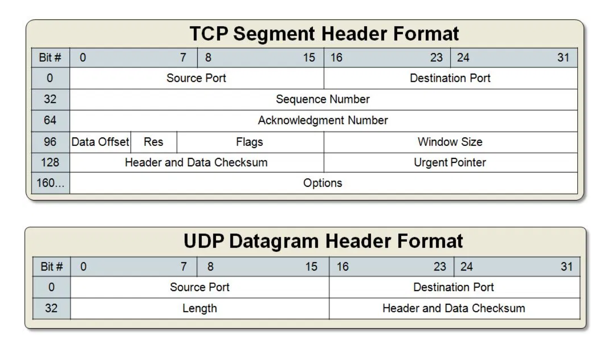

# UDP(User Datagram Protocol)

# UDP란?

- User Datagram Protocol의 약자로 데이터를 데이터그램 단위로 처리하는 프로토콜이다.
- 데이터그램 단위로 쪼개면서 전송하기 때문에 전송 계층이다.
- 비연결형, 신뢰성 없는 전송 프로토콜이다.
- TCP 보다 신뢰성이 떨어지지만 전송 속도가 일반적으로 빠른 프로토콜(순차 전송 X, 흐름 제어 X, 혼잡 제어 X)
- 주로 실시간 방송과 온라인 게임에서 사용된다. 네트워크 환경이 안 좋을때, 끊기는 현상을 생각하면 된다.

## UDP 헤더

- Source port : 시작 포트
- Destination port : 도착지 포트
- Length : 길이
- *Checksum* : 오류 검출
    - 중복 검사의 한 형태로, 오류 정정을 통해 공간이나 시간 속에서 송신된 자료의 무결성을 보호하는 단순한 방법이다.

이렇게 간단하므로, TCP 보다 용량이 가볍고 송신 속도가 빠르게 작동됨.

그러나 확인 응답을 못하므로, TCP보다 신뢰도가 떨어짐.

UDP는 비연결성, TCP는 연결성으로 정의할 수 있음.

## DNS에서 UDP 통신 프로토콜을 사용

DNS는 Application layer protocol임.

모든 Application layer protocol은 TCP, UDP 중 하나의 Transport layer protocol을 사용해야 함.(TCP는 reliable, UDP는 not reliable임)

DNS는 reliable해야할 것 같은데 왜 UDP를 사용할까?

- Request의 양이 작음 -> UDP Request에 담길 수 있다.

    > DNS query는 single UDP request와 server로부터의 single UDP reply로 구성되어 있음.
    >
- TCP가 3-way handshake를 사용하는 반면, UDP는 connection 을 유지할 필요가 없음. → 오버헤드 발생 줄임
- UDP는 비신뢰성이지만 신뢰성 과정을 application layer에 추가될 수 있음. (Timeout 추가나, resend 작업을 통해)