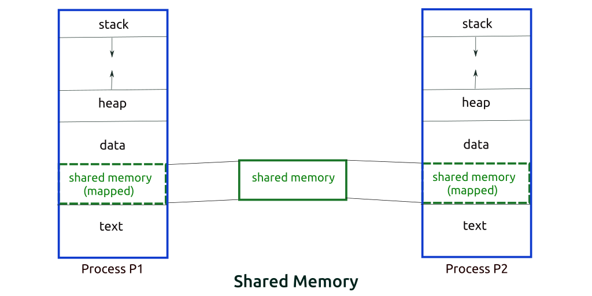
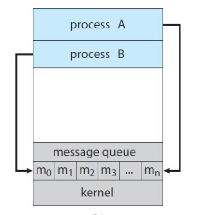
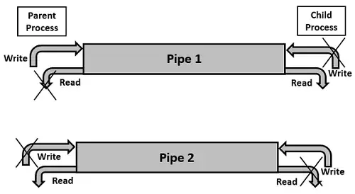
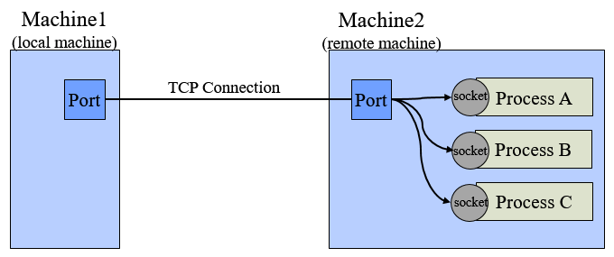

# IPC(Inter Process Communication)

# IPC 통신?

프로세스는 독립적으로 실행된다. 즉, 독립 되어있다는 것은 다른 프로세스에게 영향을 받지 않는다고 말할 수 있다. (스레드는 프로세스 안에서 자원을 공유하므로 영향을 받는다)

IPC 통신은 독립적 구조를 가진 **프로세스 간의 통신**을 가능하도록 해주는 것이다.

프로세스는 커널이 제공하는 IPC 설비를 이용해 프로세스간 통신을 할 수 있게 된다.

***커널이란?***

`운영체제의 핵심적인 부분으로, 다른 모든 부분에 여러 기본적인 서비스를 제공해줌`

IPC는 크게 두 가지 모델로 나뉜다.

## *****IPC 모델: Shared Memory*****

- 두 개 이상의 프로세스들이 주소 공간의 일부를 공유하며, 공유한 메모리 영역에 읽기/쓰기를 통해 통신을 수행한다. (Read and Write)
- 프로세스가 공유 메모리 할당을 커널에 요청하면, 커널은 해당 프로세스에 메모리 공간을 할당해 주게 되고, 이후 어떤 프로세스건 해당 메모리 영역에 접근할 수 있다. 공유 메모리가 설정되면, 그 이후의 통신은 커널의 관여 없이 진행이 가능하다.
- 장점
    - 커널의 관여 없이 메모리를 직접 사용하여 IPC 속도가 빠르다.
    - 프로그램 레벨에서 통신 기능을 제공하여, 자유로운 통신이 가능하다.
- 단점
    - 메시지 전달 방식이 아니기에 데이터를 읽어야 하는 시점을 알 수 없다.
    - 예를 들어, 프로세스 A가 공유 메모리에 데이터를 전달해도 프로세스 B가 그것을 알 수 없다.
    - 그렇기 때문에 별도의 동기화 기술이 필요하다.
    - 동시에 같은 메모리 위치를 접근하는 위치가 발생할 수 있다. (공유 메모리에 접근할 프로세스 간의 Lock 메커니즘이 필요하다.)

## *****IPC 모델: 메시지 전달 (Message Passing)*****

- 커널 메모리 영역에 메시지 전달을 위한 채널을 만들어서 협력하는 프로세스들 사이에 메시지 형태로 정보를 Send/Receive 하는 방법이다.
- 커널을 경유하여 메시지를 송/수신자끼리 주고 받으며, 커널에서는 데이터를 버퍼링한다.
- 예를 들어, A 프로세스가 커널로 메시지를 보내면 커널이 B에게 메시지를 보내주는 방식이다.
- 프로세스 간 메모리 공유 없이 동작이 가능하다.
- 장점
    - 커널에서 데이터의 주고 받는 것을 컨트롤할 수 있어 별도의 동기화 로직이 없어도 된다.
- 단점
    - 커널을 통해서 데이터를 주고 받기 때문에 Shared Memory 모델보다 느리다.

### *****메시지 전달 모델의 종류*****

**Direct Communication**

통신하려는 프로세스의 이름을 명시적으로 표시하여 메시지를 직접 전달하는 방식이다.

- 예를 들어 A 프로세스가 B 프로세스에게 메시지를 전달하고 싶을 때, 커널에게 직접적으로 수신자 A 프로세스가 메시지를 전달한 후 커널이 B 프로세스에게 해당 메시지를 전달하는 방식이다.
- 프로세스 간 링크는 유일하다.
- 대부분 양방향으로 구성된다.

**Indirect Communication**

mailbox(또는 port)를 통해 메시지를 간접 전달하는 방식이다.

- port로 전송만 하면 되기 때문에 복잡한 Communication Link를 만들 수 있으며, 다 : 다 관계가 가능하다.
- 예를 들어 A 프로세스가 B 프로세스에게 메시지를 전달하고 싶을 때, 커널 내부 특정 포트에 메시지를 저장해 놓고, B 프로세스가 해당 포트에 접근하여 메시지를 전달하는 방식이다.

1. ****메시지 전달 모델의 예시 1 : 파이프****

- 두 개의 프로세스를 파이프로 연결하여 하나의 프로세스는 데이터를 쓰기만 하고 다른 프로세스는 데이터를 읽기만 하며 데이터를 통신한다.
- 1:1 통신이면서 한 쪽 방향으로만 데이터가 이동한다.
- 주로 부모-자식 간의 단방향 통신으로 사용된다.
- 용량 제한이 있기 때문에 파이프가 가득 차면 더 이상 쓸 수 없다.
- 한 쪽 프로세스는 단지 읽기만 하고 다른 프로세스는 단지 쓰기만 하는 단순한 데이터 흐름에 적합하다.

1. ****메시지 전달 예시 2: 메시지 큐****

- FIFO 자료 구조를 가지는 큐를 이용하여 데이터를 전송 및 수신하는 방식이다.
- 위의 파이프가 스트림 기반으로 동작한다면, 메시지 큐는 메시지 (또는 패킷) 단위로 동작한다.
- 부모/자식 관계가 아니더라도, 어느 프로세스 간의 데이터 송수신이 가능하다는 장점이 있다.
- 양방향 통신이 가능하며, 메시지의 형태는 사용자가 정의하여 사용할 수 있다.
- Message Queue에 쓸 데이터에 번호를 붙임으로써 다수의 프로세스가 동시에 데이터를 쉽게 다룰 수 있다.

1. ****메시지 전달 예시 3: 소켓****

**소켓**

- socket은 네트워크 상에서 통신하기 위한 종단점으로 추상화된 개념이다.
- 소켓 통신은 흔히 네트워크 통신 기법으로 많이 사용되는 방법으로, 양쪽 PC에서 각각 임의의 포트를 정하고 해당 포트 간의 대화를 통해 데이터를 주고 받는 방식이다.