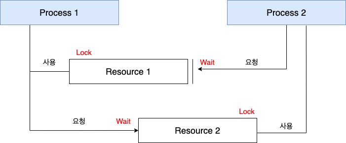

### 데드락 (DeadLock, 교착 상태)

> 두 개 이상의 프로세스나 스레드가 서로 자원을 얻지 못해서 다음 과정을 처리하지 못하는 상태  
> 즉, <U>무한히 다음 자원을 기다리게 되는 상태</U>를 말한다.  
> 시스템적으로 한정된 자원을 여러 곳에서 사용하려고 할 때 발생한다.

 

### 교착 상태가 일어나는 경우

프로세스 1과 2가 각각 자원 2와 1을 얻어야 한다고 가정해보자.  
서로 원하는 자원이 상대방에게 이미 할당되어 있어서 두 프로세스는 무한정 wait 상태에 빠지게 된다.  
= 데드락(교착 상태)  

- t1 
  - 프로세스 1이 자원 1을 얻음.
  - 프로세스 2가 자원 2를 얻음.
    
- t2
    - 프로세스 1은 자원 2를 기다림.
    - 프로세스 2는 자원 1을 기다림.

### 데드락 발생 조건
아래의 4가지 조건이 모두 성립해야 데드락 발생  

1. **상호 배제(Mutual Exclusion)**
   - 자원은 한 번에 한 프로세스만 사용할 수 있음  
  
  
2. **점유 대기(Hold and Wait)**
   - 최소한 하나의 자원을 점유하고 있으면서 다른 프로세스에 할당되어 사용하고 있는 자원을 추가로 점유하기 위해 대기하는 프로세스가 존재해야 함.  
  

3. **비선점(No preemption)**
   - 다른 프로세스에 할당된 자원은 사용이 끝날 때까지 강제로 빼앗을 수 없음.  
  

4. **순환 대기(Circular wait)**
   - 프로세스의 집합에서 순환 형태로 자원을 대기하고 있어야 함.

### 데드락(DeadLock) 처리   
### 교착상태 예방 및 회피
1. 예방(prevention)
   - 교착 상태 발생 조건 중 하나를 제거하면서 해결한다.
      - 상호 배제 부정 : 여러 프로세스가 공유 자원 사용
      - 점유 대기 부정 : 프로세스 실행 전 모든 자원을 할당
      - 비선점 부정 : 자원 점유 중인 프로세스가 다른 자원을 요구할 때, 가진 자원 반납
      - 순환 대기 부정 : 자원에 고유번호 할당 후 순서대로 자원 요구
  
2. 회피(avoidance)
  - 교착 상태 발생 시 피해나가는 방법
    - **은행원 알고리즘**
      - 은행에서 모든 고객의 요구가 충족되도록 제공하는 것과 같음.
      - 프로세스가 자원을 요구할 때, 시스템은 자원을 할당한 후에도 안정 상태로 남아있게 되는지 사전에 검사하여 교착 상태 회피
      - 안정 상태면 자원 할당, 아니면 다른 프로세스들이 자원 해지까지 대기
  

### 교착상태 탐지 및 회복
교착 상태가 되도록 허용한 다음에 회복을 시키는 방법이다.

1. 탐지(Detection)
   - 자원 할당 그래프를 통해 교착 상태를 탐지한다.

2. 회복(Recovery)
  - 교착 상태를 일으킨 프로세스를 종료하거나, 할당된 자원을 해제시켜 회복시키는 방법 

  - **프로세스 종료 방법**
    - 교착 상태의 프로세스를 모두 중지
    - 교착 상태가 제거될 때까지 하나씩 프로세스 중지
  
  - **자원 선점 방법**
    - 교착 상태의 프로세스가 점유하고 있는 자원을 선점해 다른 프로세스에게 할당(해당 프로세스 일시정지)
    - 우선 순위가 낮은 프로세스나 수행 횟수 적은 프로세스 위주로 프로세스 자원 선점 

