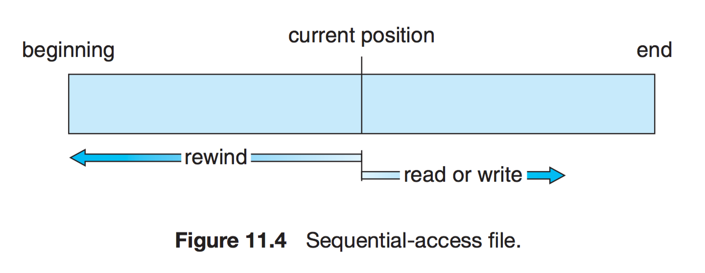
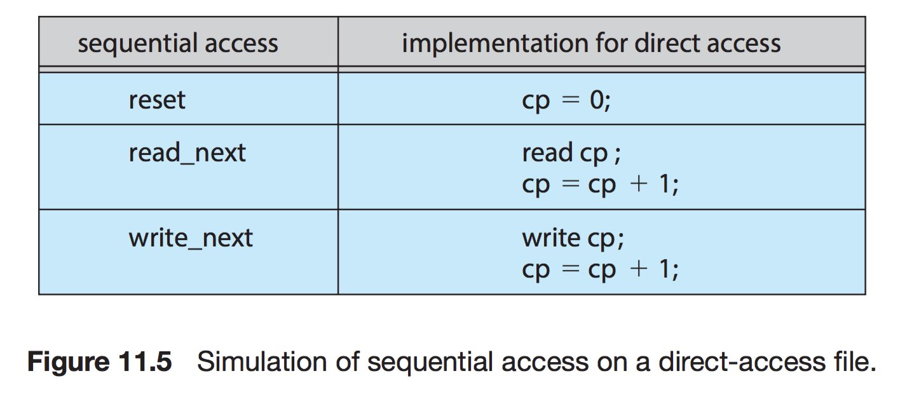
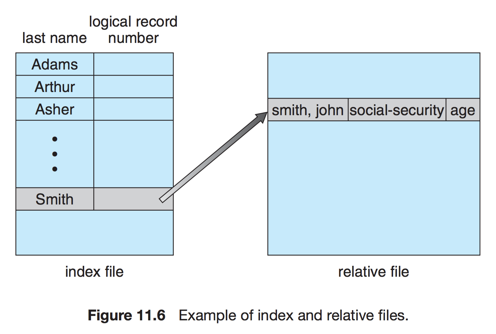
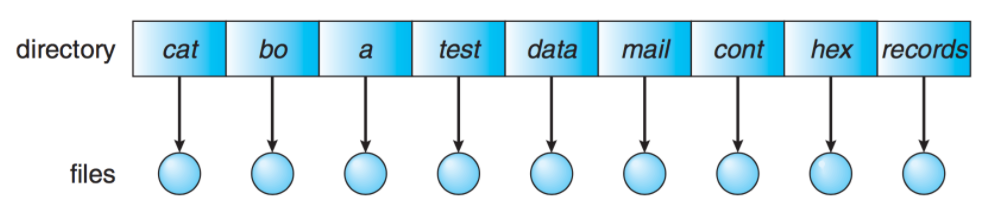
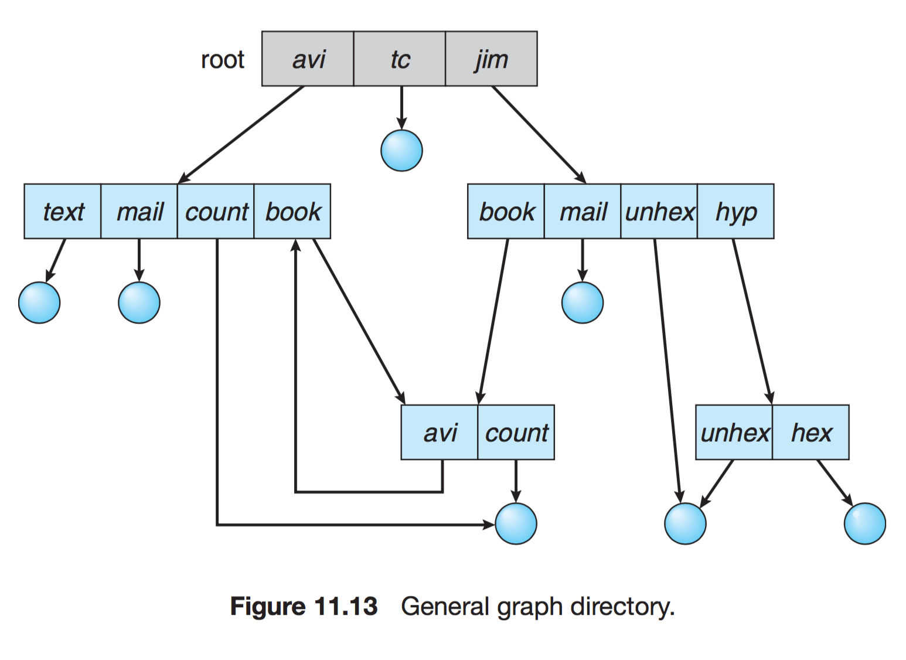

# 파일 시스템(File System)

## 파일 시스템(File System)

- 파일 : 논리적인 저장 단위로, 관련된 정보 자료들의 집합에 이름을 붙인 것
    - **파일 속성** 또는 **파일 메타데이터** : 파일을 관리하기 위한 각종 정보
- 컴퓨터에서 파일이나 모든 데이터를 쉽게 발견할 수 있도록, 유지 및 관리하는 방법
- 시스템 내의 모든 파일에 관한 정보를 제공하는 계층적 디렉터리 구조
- 파일 및 파일의 메타데이터, 디렉터리 정보 등을 관리

## 파일 정보 접근 방법

1. ****순차 접근(Sequential Access)****
- 가장 간단한 접근 방법으로, 대부분 연산은 read와 write
- 현재 위치를 가리키는 포인터에서 시스템 콜이 발생할 경우 포인터를 앞으로 보내면서 read와 write를 진행. 뒤로 돌아갈 땐 지정한 offset만큼 되감기를 해야 한다. (테이프 모델 기반)

1. ****직접 접근(Direct Access)****
- 특별한 순서없이, 빠르게 레코드를 read, write 가능
- 현재 위치를 가리키는 cp 변수만 유지하면 직접 접근 파일을 가지고 순차 파일 기능을 쉽게 구현이 가능하다.
- 무작위 파일 블록에 대한 임의 접근을 허용한다. 따라서 순서의 제약이 없음
- 대규모 정보를 접근할 때 유용하기 때문에 '데이터베이스'에 활용된다.

    

1. **색인 접근(Index Access)**
- 파일에서 레코드를 찾기 위해 색인을 먼저 찾고 대응되는 포인터를 얻는다. 이를 통해 파일에 직접 접근하여 원하는 데이터를 얻을 수 있다. 따라서 크기가 큰 파일에서 유용하다.

    
## ****디렉터리와 디스크 구조****

1. **1단계 디렉터리**

    

**모든 파일들이 디렉터리 밑에 존재하는 형태**이다. 파일들은 서로 유일한 이름을 가지고 서로 다른 사용자라도 같은 이름을 사용할 수 없다.

1. **2단계 디렉터리**

    

**각 사용자별로 별도의 디렉터리를 갖는 형태**이다.

UFD : 자신만의 사용자 파일 디렉터리
MFD : 사용자의 이름과 계정 번호로 색인되어 있는 디렉터리. 각 엔트리는 사용자의 UFD를 가리킨다.

1. 트리구조 디렉터리

    

**자신의 서브 디렉터리(Sub-Directory)를 만들어서 파일을 구성**

하나의 루트 디렉터리를 가지며 모든 파일은 고유한 경로(절대 경로/상대 경로)를 가진다. 이를 통해 효율적인 탐색이 가능하고, 그룹화가 가능하다.

디렉터리는 일종의 파일이므로 일반 파일인지 디렉터리인지 구분할 필요가 있다. 이를 bit를 사용하여 0이면 일반 파일, 1이면 디렉터리로 구분한다.

1. 그래프 구조 디렉터리

    

**디렉터리들이 서브 디렉터리들과 파일을 공유할 수 있도록 한다.**
파일을 무작정 삭제하게 되면 현재 파일을 가리키는 포인터는 대상이 사라지게 된다. 따라서 참조되는 파일에 참조 계수를 두어서, 참조 계수가 0이 되면 파일을 참조하는 링크가 존재하지 않는다는 의미이므로 그때 파일을 삭제할 수 있도록 한다.