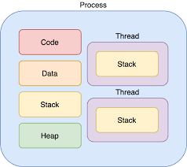
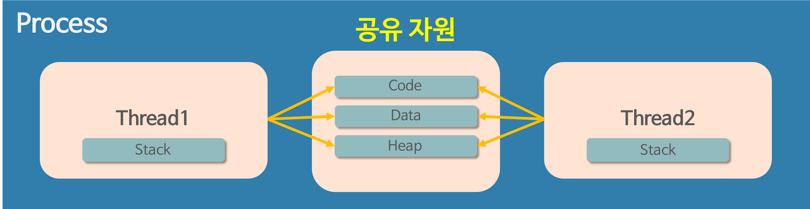

# 프로세스 & 스레드

✅ **프로세스**

: 운영체제로부터 자원을 할당받은 **작업의 단위**

✅ **스레드**

: 프로세스가 할당받은 자원을 이용하는 **실행 흐름의 단위**

# 프로세스

- 하드디스크에 있는 프로그램을 실행하면, 실행을 위해서 **메모리 할당**이 이루어지고, 할당된 메모리 공간으로 바이너리 코드가 올라가게 된다. 이 순간부터 **프로세스**라 불린다.
- 내부에는 최소 하나의 스레드를 가지고 있다.

- 프로세스의 메모리 영역
    - Code 영역
        - 실행할 프로그램의 코드나 명령어들이 기계어 형태로 저장된 영역이다. CPU는 코드영역에 저장된 명령어들을 하나씩 처리한다.
    - Data 영역
        - 코드에서 선언한 전역 변수와 정적 변수가 저장되는 영역이다. 프로그램이 실행되면서 할당되고 종료되면서 소멸한다.
    - Stack 영역
        - 함수 안에서 선언된 지역변수, 매개변수, 리터값등이 저장된다. 함수 호출시 기록되고 종료되면 제거된다. (임시 메모리 영역)
    - Heap 영역
        - 관리가 가능한 데이터 이외의 다른 형태의 데이터를 관리하기 위한 자유공간이다. (new(), malloc() 등)

# 스레드

- 프로세스 하나만을 사용해서 프로그램을 실행하기에는 메모리의 낭비가 발생한다. 스**레드는 프로세스와 다르게 스레드 간 메모리를 공유하며 작동한다. → 공유자원을 가진다.**

# 멀티 스레드 vs 멀티 프로세스

### **멀티프로세스**

> 하나의 프로그램을 여러개의 프로세스로 구성하여 각 프로세스가 병렬적으로 작업을 수행하는 것
>

**장점** : 안전성 (메모리 침범 문제를 OS 차원에서 해결)

**단점** : 각각 독립된 메모리 영역을 갖고 있어, 작업량 많을 수록 오버헤드 발생. Context Switching으로 인한 성능 저하

***Context Switching*이란?**

**하나의 프로세스가 이미 CPU 를 사용중인 상태에서 다른 프로세스가 CPU 를 사용하기 위해 이전 프로세스의 상태를 저장하고 새로운 프로세스의 상태를 적재하는 것.**

• ex) 카카오톡을 켜놓고 유튜브로 노래를 들으면서 웹서핑을 하는 것은 사용자 입장에서 동시에 일어나는 일처럼 보이지만 실제로는 그렇지 않음. PU 가 재빠르게 여러 프로세스를 번갈아가며 실행하고 관리하고 있는것. 이때 프로세스를 번갈아가면서 처리하는 것을 Context Switching(문맥교환)이라고 한다.

### **멀티 스레드**

> 하나의 응용 프로그램에서 여러 스레드를 구성해 각 스레드가 하나의 작업을 처리하는 것
>

스레드들이 공유 메모리를 통해 다수의 작업을 동시에 처리하도록 해줌

**장점** : 독립적인 프로세스에 비해 공유 메모리만큼의 시간, 자원 손실이 감소 전역 변수와 정적 변수에 대한 자료 공유 가능

**단점** : 하나의 스레드가 데이터 공간 망가뜨리면, 모든 스레드가 작동 불능 상태 (공유 메모리를 갖기 때문)

    동기화 문제

- Critical Section 기법을 통해 대비함 - 하나의 스레드가 공유 데이터 값을 변경하는 시점에 다른 스레드가 그 값을 읽으려할 때 발생하는 문제를 해결하기 위한 동기화 과정