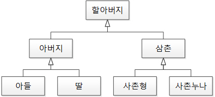
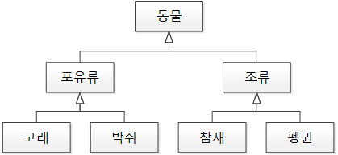

# 객체지향프로그래밍

### **객체 지향 프로그래밍이란?**

객체 지향 프로그래밍 (Object-Oriented Programming, OOP)은 프로그래밍에서 필요한 데이터를 추상화 시켜 상태와 행위를 가진 객체로 만들고, 객체들간의 상호작용을 통해 로직을 구성하는 프로그래밍 방법이다.

### **객체 지향 프로그래밍의 특징**

**객체 지향 프로그래밍은 크게 추상화 , 캡슐화 , 상속 , 다형성 의 네가지 특징을 가진다.**

### **1. 추상화**

- **객체에서 공통된 속성과 행위를 추출해 타입을 정의하는 과정**
- **추상화는 불필요한 정보는 숨기고 중요한 정보만을 표현함으로써 프로그램을 간단하게 만드는 것**

ex. 아우디, BMW, 벤츠는 모두 '자동차'라는 공통점이 있다. 자동차라는 추상화 집합을 만들어두고, 자동차들이 가진 공통적인 특징들을 만들어 활용한다.

**추상화가 왜 필요할까?**

예를 들면, '싼타페'와 같은 다른 자동차가 추가될 수도 있다. 이때 추상화로 구현해두면 다른 곳의 코드는 수정할 필요 없이 추가로 만들 부분만 새로 생성해주면 된다.

### **2. 캡슐화**

- **데이터 구조와 데이터를 다루는 방법들을 결합 시켜 묶는 것 (변수와 함수를 하나로 묶는 것을 뜻함)**
- **낮은 결합도를 유지할 수 있도록 설계하는 것**
- **한 곳에서 변화가 일어나도 다른 곳에 미치는 영향을 최소화 시키는 것을 말한다.**

**결합도(coupling)란, 어떤 기능을 실행할 때 다른 클래스나 모듈에 얼마나 의존적인가를 나타내는 말이다.**

- **결합도 낮게 유지하는 비결은 정보 은닉 → 외부에서 접근할 필요가 없는 것들은 private으로 접근하지 못하도록 제한**

### **4. 다형성**

- **서로 다른 클래스의 객체가 같은 메시지를 받았을 때 각자의 방식으로 동작하는 능력**
- **즉, 부모 클래스의 메소드를 자식 클래스가 오버라이딩해서 자신의 역할에 맞게 활용하는 것이 다형성**

**오버라이딩**

- **상위 클래스가 가지고 있는 메소드를 하위 클래스가 재정의해서 사용하는 것**

**오버로딩**

- **같은 이름의 메서드가 인자의 개수나 자료형에 따라 다른 기능을 하는 것**

## **객체 지향 설계 원칙 SOLID**

### **1. 단일 책임 원칙 (SRP, Single Responsibility Principle)**

- **하나의 클래스는 단 하나의 책임만 가져야 한다.**
- **단일 책임 원칙을 지키지 않을 경우 한 책임의 변경에 의해 다른 책임과 관련된 코드에 영향이 갈 수 있다.**

### **2. 개방-폐쇄 원칙 (OCP, Open/Closed Principle)**

- **확장에는 열려있고 변경에는 닫혀 있어야 한다.**

### **3. 리스코프 치환 원칙 (LSP, Liskov Substitution Principle)**

**상위 타입의 객체를 하위 타입의 객체로 치환해도, 상위 타입을 사용하는 프로그램은 정상적으로 동작해야 한다.**



**리스코프 치환 원칙 위배**



**리스코프 치환 원칙 준수**

### **4. 인터페이스 분리 원칙 (ISP, Interface Segregation Principle)**

**하나의 일반적인 인터페이스보다 여러 개의 구체적인 인터페이스가 낫다.**

```java
@Component
public class SHA256PasswordEncoder implements PasswordEncoder {

	@Override
	public String encryptPassword(final String pw)  {
		...//암호화 해주는 로직
	}
       //입력한 비밀번호가 기존 비밀번호랑 동일한지 확인하는 로직
	public String isCorrectPassword(final String rawPw, final String pw) {
		final String encryptedPw = encryptPassword(rawPw);
		return encryptedPw.equals(pw);
	}
}
```

---

**클라이언트의 목적과 용도에 적합한 인터페이스 만을 제공한다는 인터페이스 분리 원칙을 지키기 위해서 암호화 로직과 비밀번호 확인 로직은 분리하는게 좋다.**

```java
public interface PasswordChecker {
    String isCorrectPassword(final String rawPw, final String pw);
}

@Component
public class SHA256PasswordEncoder implements PasswordEncoder, PasswordChecker {

	@Override
	public String encryptPassword(final String pw)  {
		...
	}

	@Override
	public String isCorrectPassword(final String rawPw, final String pw) {
		final String encryptedPw = encryptPassword(rawPw);
		return encryptedPw.equals(pw);
	}
}
```

---

### **5. 의존관계 역전 원칙 (DIP), Dependency Inversion Principle)**


- **추상화에 의존해야지 구체화에 의존하면 안된다.**
- **UserService가 SimplePasswordEncode(구체화)에 직접 의존하는 것은 DIP에 위배되는 것이다. 그러므로 UserService가 변하지 않는 추상화에 의존하도록 변경이 필요하고, 우리**

